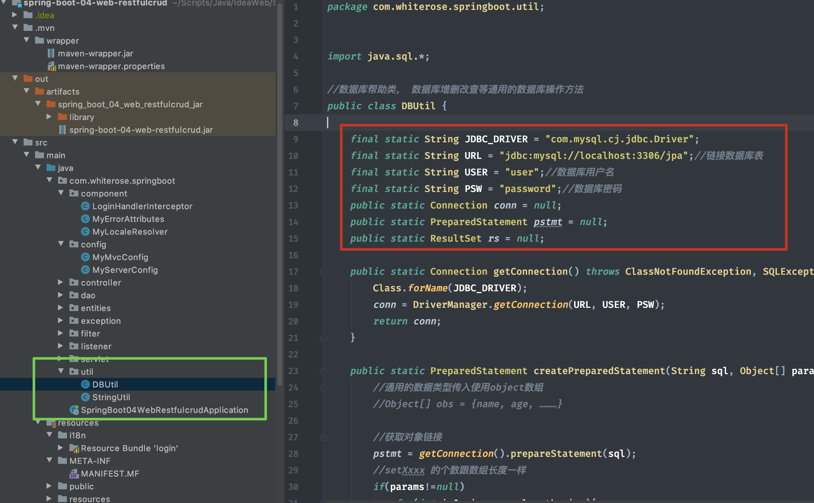
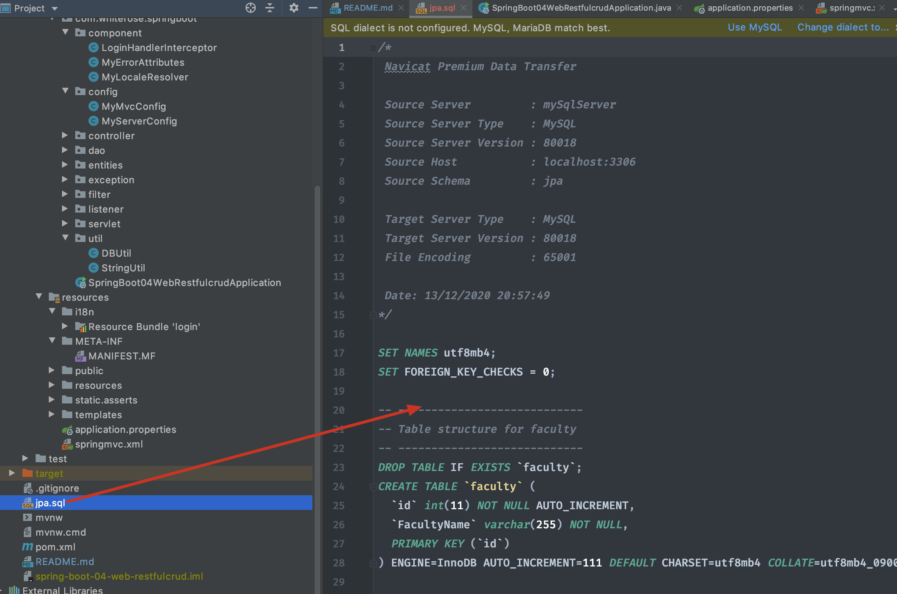
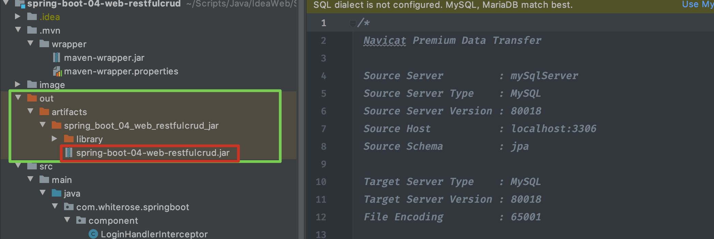
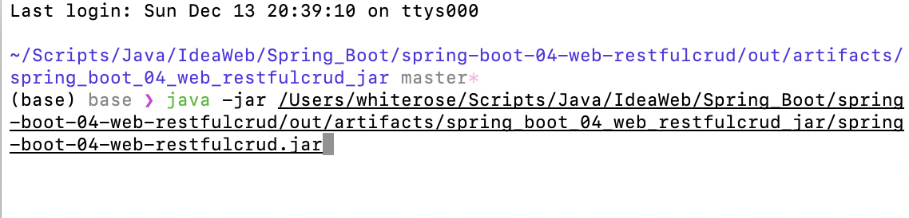
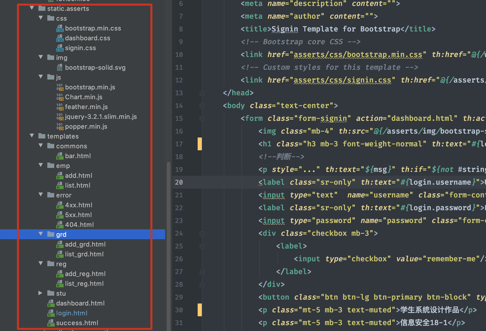
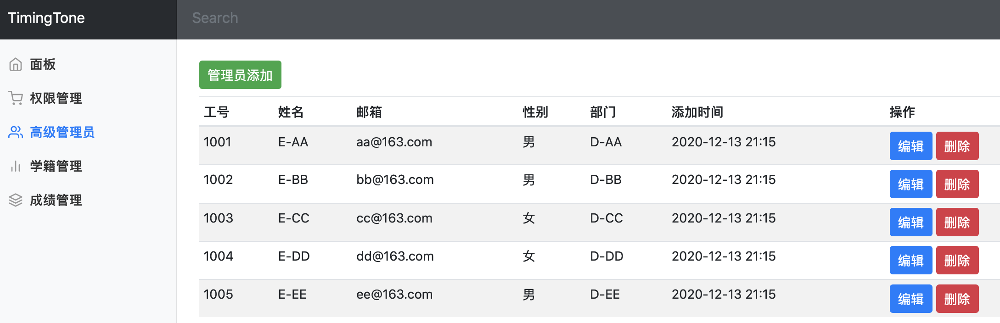
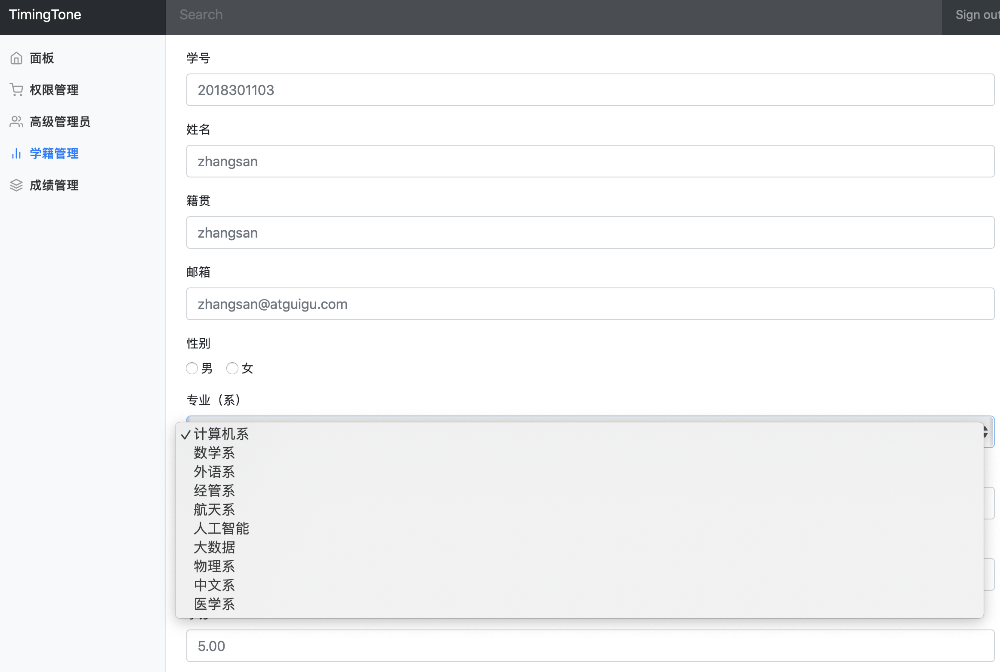

## ILLUSTRATION

Development Environment: IntelliJ IDEA 2019.3.4

Tomcat: 9.0.33

Mysql-connector-java-8.0.19

Spring-Boot: 2.2.6

localhost:8083/crud/

Mr.Yin 2018301103

### 运行说明

1. 自行修改红色框部分

   

2. 创建数据库：jpa，导入数据库文件脚本（使用Navicat）。

   

3. 使用jar包运行

   找到jar包位置：

   

   在terminal下输入java -jar 绝对路径

   或者直接双击jar包

   

4. 浏览器输入localhost:8083/crud/

   用户名 密码：Mr.Yin 2018301103

5. 如需扩展前端界面，请自己添加功能，我懒得写了

   

### 运行截图

